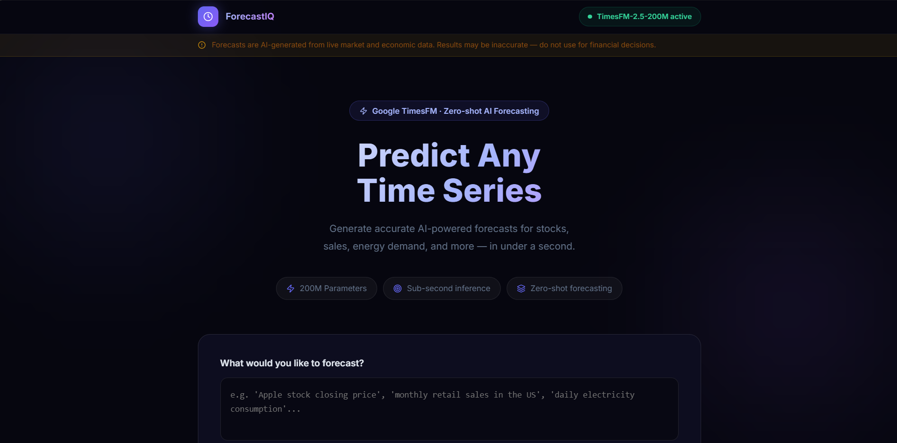
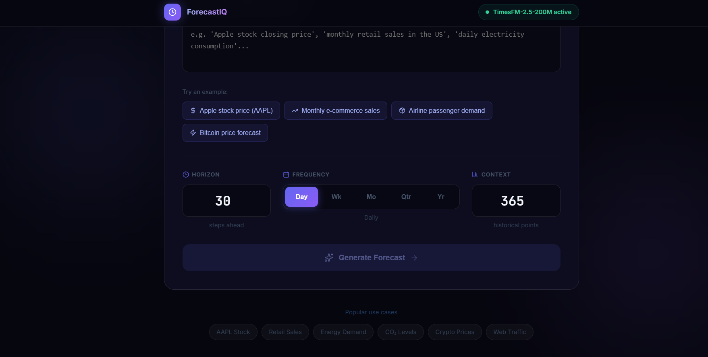
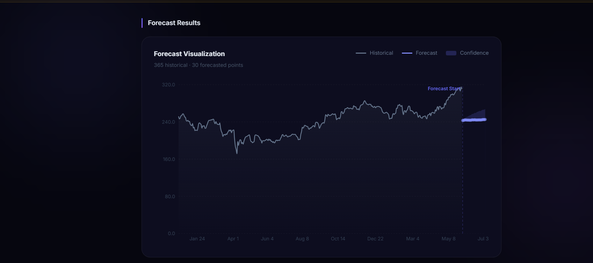
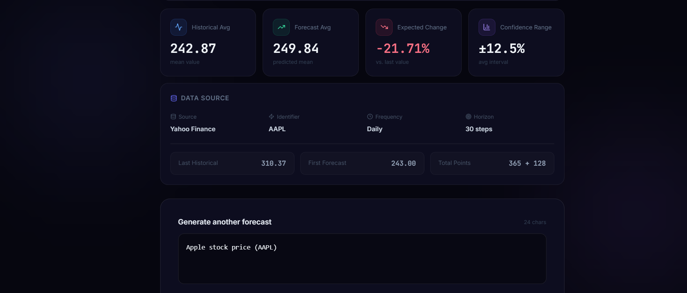

# ForecastIQ

### AI-Powered Time Series Forecasting Platform

ForecastIQ is a full-stack forecasting application powered by Google's TimesFM foundation model. It enables users to generate forecasts from natural-language queries and visualize future trends through interactive dashboards, confidence intervals, and analytics.

The platform combines a FastAPI backend, a React + TypeScript frontend, and TimesFM-based inference to deliver forecasting capabilities across financial and economic datasets.

Users can enter natural-language queries such as:

* Apple stock price
* Bitcoin price forecast
* S&P 500 index
* Airline passenger demand
* Atmospheric CO₂ levels

The system automatically retrieves historical data, generates forecasts using TimesFM, and visualizes results through interactive charts and analytics.

---

## Overview

ForecastIQ transforms natural-language forecasting requests into interactive visual predictions.

Users simply describe what they want to forecast, and the platform:

1. Identifies the relevant data source.
2. Retrieves historical time-series data.
3. Generates forecasts using Google's TimesFM model.
4. Calculates confidence intervals and trend metrics.
5. Displays results through interactive visualizations.

Supported use cases include:

* Stock market forecasting
* Cryptocurrency forecasting
* Economic trend analysis
* Demand forecasting
* General time-series prediction

---

## Dashboard Preview

<table>
<tr>
<td width="50%">

</td>
<td width="50%">

</td>
</tr>

<tr>
<td width="50%">

</td>
<td width="50%">

</td>
</tr>
</table>

---

## Features

* Natural language forecasting interface
* Google TimesFM-based zero-shot forecasting
* Interactive forecasting charts with confidence intervals
* Historical vs forecast trend comparison
* Live financial market data integration
* Economic and macroeconomic dataset support
* FastAPI REST API backend
* React + TypeScript frontend
* Responsive dashboard design
* Real-time error handling and dataset suggestions

---

## Example Forecast Queries

Try the following examples:

* Apple stock price
* Bitcoin price
* Tesla stock price
* Microsoft stock price
* S&P 500 Index
* Airline passenger demand
* Atmospheric CO₂ levels
* Monthly retail sales

---

## System Architecture

```text
┌──────────────────────────────────────────┐
│               User Query                 │
│                                          │
│ "Apple stock price next 30 days"         │
└──────────────────────────────────────────┘
                    │
                    ▼
┌──────────────────────────────────────────┐
│         React + TypeScript Frontend      │
│                                          │
│ • Query Input                            │
│ • Forecast Controls                      │
│ • Interactive Dashboard                  │
└──────────────────────────────────────────┘
                    │
                    ▼
┌──────────────────────────────────────────┐
│              FastAPI Backend             │
│                                          │
│ • Request Validation                     │
│ • Query Processing                       │
│ • Forecast Orchestration                 │
└──────────────────────────────────────────┘
                    │
         ┌──────────┴──────────┐
         ▼                     ▼
┌──────────────────┐   ┌──────────────────┐
│ Historical Data  │   │   TimesFM 2.5    │
│ Retrieval Layer  │   │ Foundation Model │
│                  │   │                  │
│ • Yahoo Finance  │   │ • Forecasting    │
│ • Economic Data  │   │ • Confidence     │
└──────────────────┘   └──────────────────┘
         │                     │
         └──────────┬──────────┘
                    ▼
┌──────────────────────────────────────────┐
│         Forecast Generation Layer        │
│                                          │
│ • Mean Prediction                        │
│ • Upper Confidence Bound                 │
│ • Lower Confidence Bound                 │
│ • Trend Metrics                          │
└──────────────────────────────────────────┘
                    │
                    ▼
┌──────────────────────────────────────────┐
│           Interactive Dashboard          │
│                                          │
│ • Forecast Chart                         │
│ • Confidence Intervals                   │
│ • Trend Analysis                         │
│ • Summary Metrics                        │
└──────────────────────────────────────────┘
```

---

## Tech Stack

| Layer                | Technology                |
| -------------------- | ------------------------- |
| Frontend             | React 19                  |
| Language             | TypeScript                |
| Build Tool           | Vite                      |
| Backend              | FastAPI                   |
| API Server           | Uvicorn                   |
| Forecasting Model    | Google TimesFM 2.5 (200M) |
| Market Data          | Yahoo Finance (yfinance)  |
| Data Analysis        | NumPy, Pandas             |
| Statistical Datasets | Statsmodels               |
| Visualization        | Recharts                  |
| Styling              | Tailwind CSS              |

---

## Project Structure

```text
ForecastIQ/
│
├── backend/
│   ├── main.py
│   ├── data_fetcher.py
│   ├── model_singleton.py
│   ├── requirements.txt
│   └── .env.example
│
├── frontend/
│   ├── src/
│   ├── components/
│   ├── hooks/
│   ├── package.json
│   └── vite.config.ts
│
├── screenshots/
│   ├── homepage.png
│   ├── input.png
│   ├── forecast-chart.png
│   └── forecast-metrics.png
│
└── README.md
```

---

## Getting Started

### Prerequisites

* Python 3.10+
* Node.js 18+
* Internet connection for initial model download

### Clone Repository

```bash
git clone https://github.com/sonisiiuu7/ForecastIQ.git
cd ForecastIQ
```

### Backend Setup

```bash
cd backend

python -m venv venv

# Windows
venv\Scripts\activate

# Linux / macOS
source venv/bin/activate

pip install -r requirements.txt

copy .env.example .env

python main.py
```

The TimesFM model will automatically download and cache during the first launch.

### Frontend Setup

Open a second terminal:

```bash
cd frontend

npm install

npm run dev
```

---

## Supported Data Sources

### Financial Assets

* Apple (AAPL)
* Microsoft (MSFT)
* Tesla (TSLA)
* NVIDIA (NVDA)
* Amazon (AMZN)
* Meta (META)
* Bitcoin (BTC-USD)
* Ethereum (ETH-USD)
* S&P 500
* NASDAQ
* Dow Jones

### Economic Datasets

* Atmospheric CO₂ Levels
* Airline Passenger Demand
* Sunspot Activity
* US Macroeconomic Indicators
* Real GDP Data

---

## API Reference

### POST /api/forecast

Generate forecasts from natural-language queries.

Example Request:

```json
{
  "problem_description": "Apple stock price",
  "horizon": 30,
  "frequency": "D",
  "context_length": 365
}
```

Example Response:

```json
{
  "historical": {},
  "forecast": {},
  "metadata": {},
  "metrics": {}
}
```

### GET /health

Returns application health status.

```json
{
  "status": "healthy",
  "model_loaded": true
}
```

---

## Future Improvements

* Forecast history tracking
* Export forecasts to CSV
* Multi-asset comparison dashboard
* User authentication
* Cloud deployment support
* Additional forecasting models

---

## Disclaimer

ForecastIQ is intended for educational, research, and experimentation purposes.

Forecasts generated by the application should not be interpreted as financial advice, investment recommendations, or guarantees of future performance. Historical trends do not guarantee future outcomes.

---

## License

Licensed under the MIT License.
